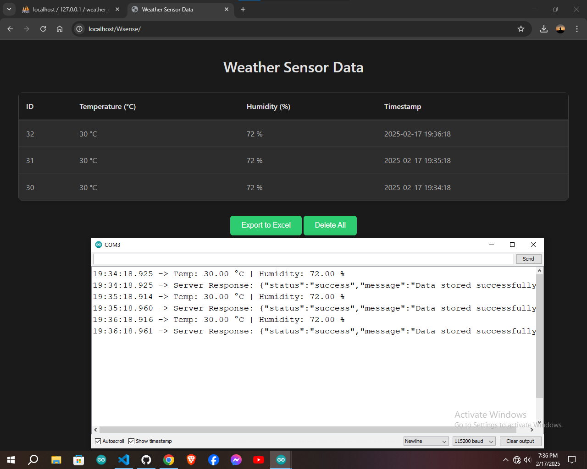
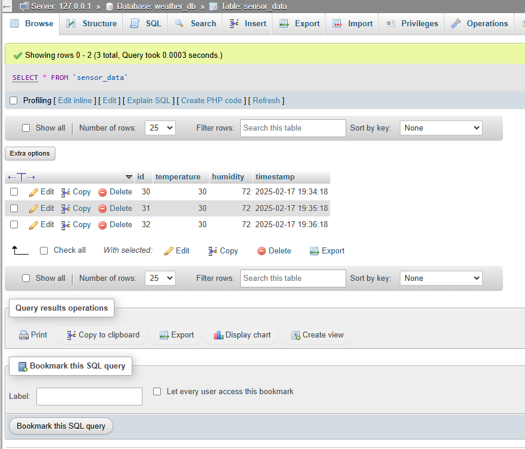

# ESP8266 Weather Station

A simple weather monitoring system built using an ESP8266, a DHT11 sensor for temperature and humidity readings, and a local PHP server to store and display the data. The ESP8266 acts as an access point and runs a web server to handle data requests.

## Features

- Reads temperature and humidity data from a DHT11 sensor.
- Hosts a web server that responds with the temperature and humidity in JSON format.
- Sends temperature and humidity data to a local PHP server using a POST request.
- The data is sent once every minute to the server.
- ESP8266 is set up in Access Point (AP) mode, enabling local access to the device.

